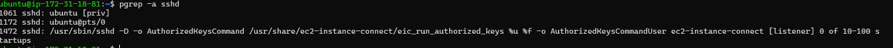
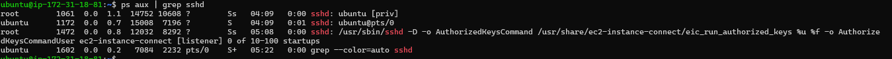
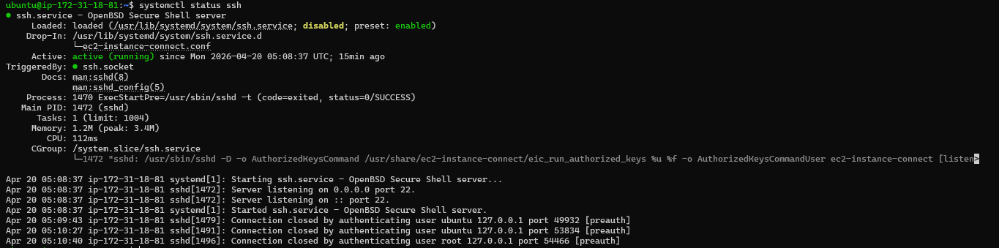
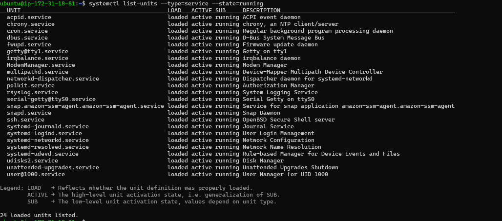
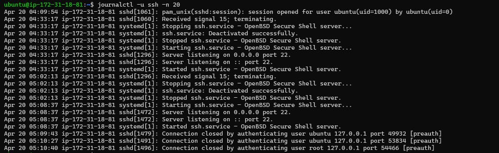
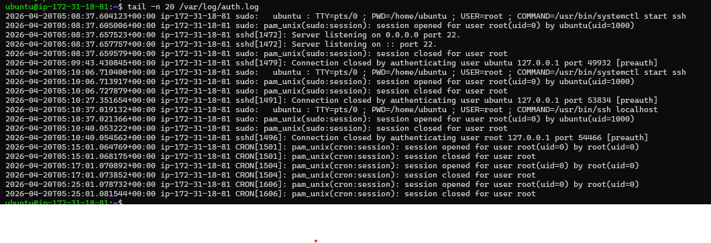

# 📄 linux-practice.md

## 🔹 Real-time Output of Commands Practiced

This document captures hands-on Linux practice focused on processes, services, and logs using the SSH service on an Ubuntu AWS EC2 instance.

---

## 🔹 Environment

- OS: Ubuntu (AWS EC2)
- Authentication: SSH key-based authentication
- Service inspected: SSH (sshd)

---

## 🔹 Process Commands

### 1. `pgrep -a sshd`

**Explanation:**  
Lists all running sshd processes, including the main listener and each active SSH session.

**Observations from output:**
- 1472 → main SSH daemon (listener)
- 1061 → privileged SSH processes
- 1172 → active user sessions (pts/0)

**Output:**  

---

### 2. `ps aux | grep sshd`

**Explanation:**  
Shows detailed resource usage and ownership of SSH daemon and session processes.

**Observations from output:**
- SSH daemon runs as root  
- User sessions run as ubuntu  
- Multiple sessions create multiple sshd processes (normal behavior)

**Output:**  

---

## 🔹 Service Commands

### 3. `systemctl status ssh`

**Explanation:**  
Displays the health, uptime, and recent activity of the SSH service managed by systemd.

**Observations from output:**
- SSH is active (running)  
- Listening on port 22  
- EC2 Instance Connect is providing SSH keys  
- Successful public key authentication  

**Output:**  

---

### 4. `systemctl list-units --type=service --state=running`

**Explanation:**  
Lists all currently running system services, confirming overall system health.

**Observations from output:**
- ssh.service is running  
- Core services (cron, systemd-journald, networkd) are active  
- Instance is stable  

**Output:**  

---

## 🔹 Log Commands

### 5. `journalctl -u ssh -n 20`

**Explanation:**  
Shows the latest SSH service logs, including service startup and authentication events.

**Observations from output:**
- SSH service startup  
- Port 22 listening  
- Accepted public key logins from real IPs  
- Session creation events  

**Output:**  

---

### 6. `tail -n 20 /var/log/auth.log`

**Explanation:**  
Displays the most recent authentication and authorization activity on the system.

**Observations from output:**
- SSH is active with successful `ubuntu` logins  
- `sudo` usage is logged for privileged commands  
- Local SSH (`127.0.0.1`) authentication failed (key issue)  
- Cron jobs are running as root  
- Logs show proper session open/close → clear audit trail  

**Output:**  

---

## ✅ Key Learnings

- SSH creates multiple processes per user session  
- AWS EC2 uses key-based SSH authentication  
- `systemctl` is used to inspect and manage services  
- Logs (`journalctl`, `auth.log`) are essential for troubleshooting and security auditing  