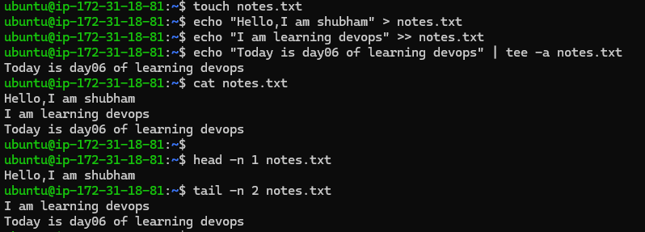

# Linux Fundamentals: Read and Write Text Files

Create a textfile with name notes.txt  
touch notes.txt  

Write to notes.txt  
echo "Hello,I am shubham" > notes.txt  

Append to notes.txt  
echo "I am learning devops" >> notes.txt  

Write using tee command that also prints the output to terminal -a appends  
echo "Today is day 06 of learning devops" | tee -a notes.txt  

Read notes.txt  
cat notes.txt  

Read first line of notes.txt  
head -n 1 notes.txt  

Read last two lines of notes.txt  
tail -n 2 notes.txt  

Write using tee command that also prints the output to terminal -a appends  
echo "Learning tee command" | tee -a notes.txt  

Hands on above commands :  
