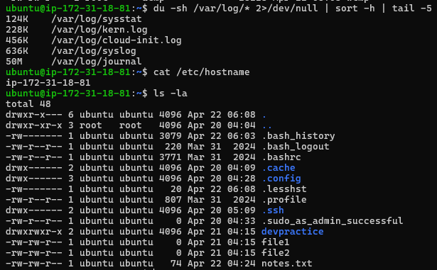
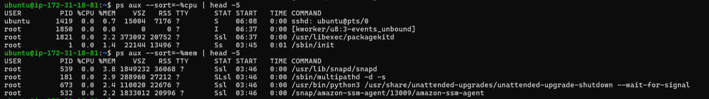

# 📄 Day 07 – Linux File System Hierarchy

This document covers important Linux directories along with commands, observations, and usage.

---

## 🔹 Core Directories

### / (root)
- Contains: Starting point of the entire Linux filesystem.
- Command: `ls -l /`
- Observation: Directories like bin, etc, home, var present.
- I would use this when: Navigating the full system structure.

---

### /home
- Contains: User home directories.
- Command: `ls -l /home`
- Observation: User folder like ubuntu present.
- I would use this when: Accessing user files.

---

### /root
- Contains: Home directory of super user (root user) separate from normal users. 
- Command: `sudo ls -l /root`
- Observation: Root-specific files.
- I would use this when: Performing admin tasks/I would use this to store files that only root should acsess

---

### /etc
- Contains: Configuration files of services, applications and the system itself. Also contains cnfiguraion files of users and passwords.
       /etc/environment: I would use this to add environment variables so they’re accessible globally.
       /etc/adduser.conf: I would use this to configure defaults for new users like shell, directory or group.
- Command: `ls -l /etc` 
- Observation: Files like hostname, passwd, ssh folder.
- I would use this when: Editing system configs.

---

### /var/log
- Contains: System and application logs.
- Command: `ls -l /var/log`
- Observation: Files like auth.log, syslog.
          auth.log : I would use this to check logs related to authentication.
          syslog : I would use this tview general system and service related logs.
- I would use this when: Troubleshooting issues.

---

### /tmp
- Contains: Temporary files created by applications, services, or users are stored here. 
- Command: `ls -l /tmp`
- Observation: Temporary files created by apps & Any files stored here will be deleted after reboot. 
- I would use this when: Storing temp data/store any files that I won't require after reboot..

---

## 🔹 Additional Directories

### /bin
- Contains: Essential command binaries.
- Command: `ls -l /bin`
- Observation: Commands like ls, cp, mv.
- I would use this when: Running basic commands.

---

### /usr/bin
- Contains: User command binaries.
- Command: `ls -l /usr/bin`
- Observation: Many executable programs.
- I would use this when: Running development tools,admin commands & installed software.

---

### /opt
- Contains: Optional or third-party software installed manually by administrators.
- Command: `ls -l /opt`
- Observation: Optional/custom software directories.
- I would use this when: installing external tools like Maven, Java apps, or custom software

---

## 🔹 Hands-on Tasks

### Find largest log files
Largest log file in /var/log

`du -sh /var/log/* 2>/dev/null | sort -h | tail -5`

Explanation : 
du -sh

du → disk usage
s → summary only (one line per file/dir)
h → human readable

2>/dev/null

2> → redirect error output
/dev/null → throw it away

sort -h →  sort output in human readeable format

tail -5 → show last five lines only

### Look at a config file in /etc
`cat /etc/hostname`

### Check your home directory
`ls -la`

---

# 🔹 Scenario-Based Practice

## Scenario 1: Service Not Starting
A service called 'ssh' failed to start after a server reboot. What commands would you run to diagnose the issue? Write at least 3-4 commands in order.

- Step 1 : `systemctl status ssh`
  Why : Check if the service is running or failed or stopped.

- Step 2 : `journalctl -u ssh -n 50`
  Why : If service is failed check logs.

- Step 3 : `systemctl is-enabled ssh`
  Why : To check if service starts automatically on boot.

## Scenario 2: High CPU Usage

- Step 1 - run cmd top ,htop for checking which process taking max cpu %

- Step 2 - sort the process which taking maximum cpu %

- Step 3 - mark a process id & monitor that process

- Step 4 - if that process is not necessary , kill the process

## Scenario 3: Finding Service Logs

A developer asks: "Where are the logs for the 'ssh' service?" The service is managed by systemd. What commands would you use?
- Step 1 : `systemctl status ssh`
  Why : Check service status first.

- Step 2 : `journalctl -u ssh -n 50`
  Why : Check last 50 lines of logs.

- Step 3 : `journalctl -u ssh -f`
  Why : Check logs real-time.

## Scenario 4: File Permissions Issue

A script at /home/user/backup.sh is not executing. When you run it: ./backup.sh You get: "Permission denied" What commands would you use to fix this?

- Step 1 : `ls -l backup.sh`
  Why : Check current permissions of file. Look for: -rw-r--r-- (notice no 'x' = not executable).

- Step 2 : `chmod +x backup.sh`
  Why : Add execute permission to file.

- Step 3: `ls -l backup.sh`
  Why : Verify it worked. Look for: -rwxr-xr-x (notice 'x' = executable).

- Step 4: `./backup.sh`
  Why : Run it.
