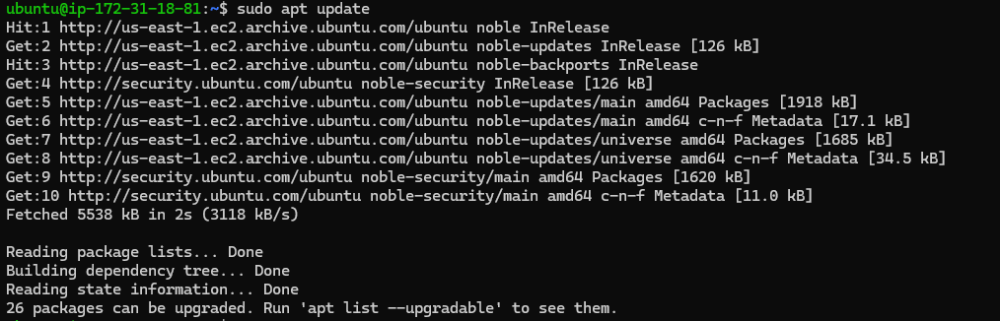
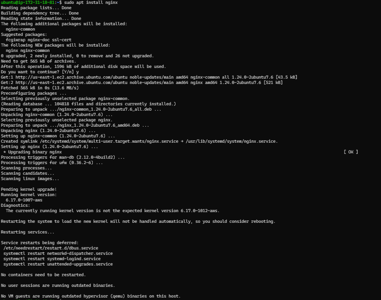
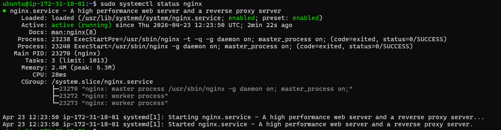
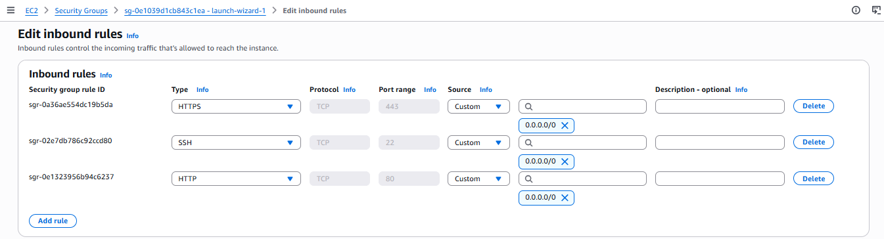
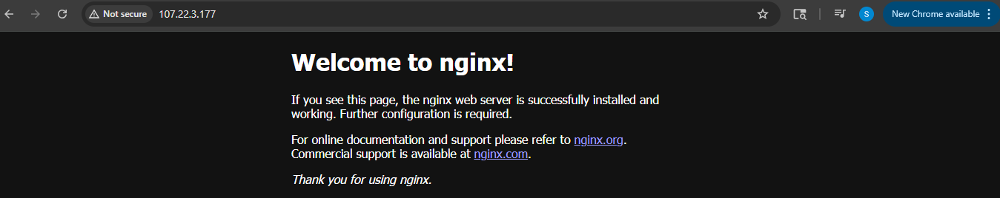
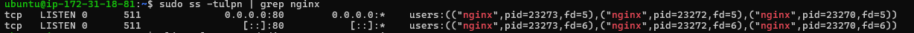
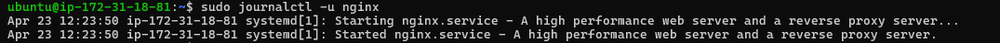
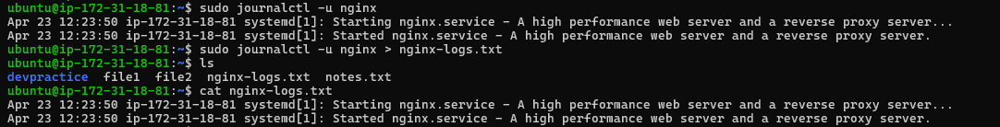
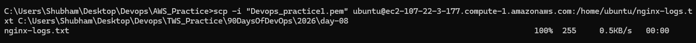

# 🔹 Deploy a Real Web Server on the Cloud

## Step 1 : Launch an instance from AWS console.

---

## Step 2 : Connect to EC2 instance using ssh.
Command : `ssh -i "Devops_practice1.pem" ubuntu@ec2-107-22-3-177.compute-1.amazonaws.com`

---

## Step 3 : Install Nginx
- Command : `sudo apt update`

- Command : `sudo apt install nginx`

- Command : `sudo systemctl status nginx`

---

## Step 4 : Configure security groups for web access. From the AWS console, go to the security group and add an inbound rule for port 80 (default for Nginx).

- Testing web access
Accessed the Nginx web server using: `http://107.22.3.177/`

Observation:
- Nginx welcome page loaded successfully in the browser.
- The service is accessible over HTTP, which uses port 80 by default.
- Port 80 is open in the security group, allowing public access.

Note:
- Port 80 is not visible in the URL because it is the default port for HTTP.
- The browser automatically uses port 80 when accessing via http://.

“Nginx is accessible over HTTP, confirming that port 80 is open and serving traffic successfully.”

---

## Step 5 : Check logs of nginx service

- Command : `sudo journalctl -u nginx`

---

## Step 6 : Save logs to file
- Command : `sudo journalctl -u nginx > nginx-logs.txt `

- Download Log File to Your Local Machine
Command : `scp -i "Devops_practice1.pem" ubuntu@ec2-107-22-3-177.compute-1.amazonaws.com:/home/ubuntu/nginx-logs.txt C:\Users\Shubham\Desktop\Devops\TWS_Practice\90DaysOfDevOps\2026\day-08`

---

# 🔹 Challenges Faced

- Initially, I was confused because the browser URL did not show port 80 while accessing the Nginx server.
- I expected to see the URL in the format http://<ip>:80, but it was only showing http://<ip>.

### How I Solved It:
- Learned that port 80 is the default port for HTTP.
- Browsers automatically use port 80 when accessing via http://, so it is hidden in the URL.
- Verified that Nginx is running on port 80 using system commands and confirmed that the service is accessible from the browser.

### Outcome:
- Successfully understood how default ports work in HTTP.
- Confirmed that Nginx is correctly serving traffic on port 80 even though it is not explicitly visible in the URL.

---

# 🔹 What I Learned
- Connect to an AWS cloud instance using SSH.

- How to manage security group (adding inbound rules)

- How to install Nginx and serve a webpage.

- The importance of reloading a service after configuration changes or adding new files.

- How to transfer files securely from the instance to the local machine using scp.

- Confusion between journalctl and access logs. Learned that journalctl -u nginx shows service logs, while HTTP requests are recorded in /var/log/nginx/access.log.

---