# File Permissions & File Operations Challenge

## Files Created
- Create empty file devops.txt using touch
- Create notes.txt with some content using cat or echo
- Create script.sh using vim with content: echo "Hello DevOps"
- Verify: ls -l to see permissions

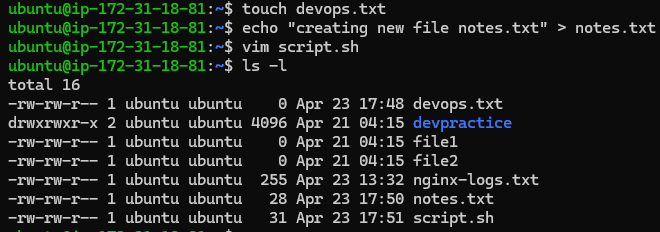

---

## Read Files
- Read notes.txt using cat

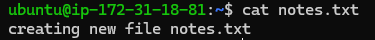

- View script.sh in vim read-only mode - vim -R script.sh

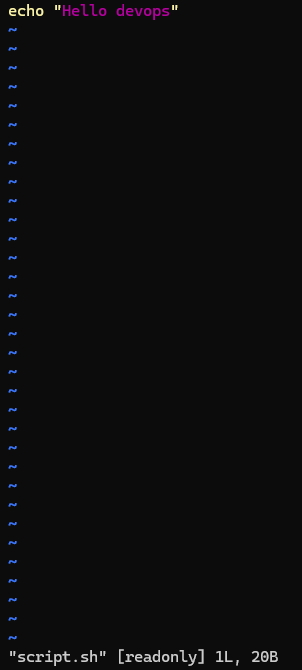

- Display first 5 lines of /etc/passwd using head

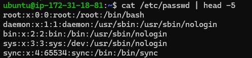

- Display last 5 lines of /etc/passwd using tail

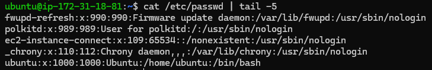

---

## Understand Permissions
- Current permissions :

   Devops.txt : -rw-rw-r--

- → indicates it’s a regular file (not a directory or special file).
- rw- → (user/owner) → read + write, no execute.
- rw- → (group) → read + write, no execute.
- r-- → (others) → read only, no write or execute.

- Same permissions applied to notes.txt and script.sh

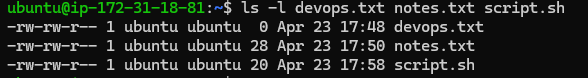

---

## Modify Permissions
- Make script.sh executable → run it with ./script.sh

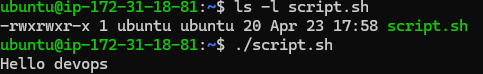

- Set devops.txt to read-only (remove write for all)

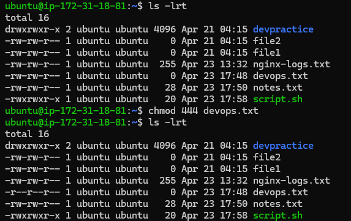

- Set notes.txt to 640 (owner: rw, group: r, others: none)

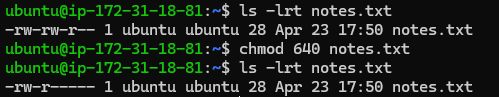

- Create directory project/ with permissions 755

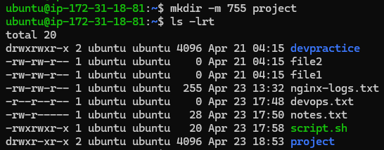

---

## Test Permissions

- Writing to a read-only file - what happens?

Explanation : Writing to a read‑only file normally gives Permission denied. With sudo, you can override and write to the file — but only if the redirection itself is executed with root privileges (using tee or sudo bash -c). Even sudo won’t help if the file is set to immutable (via chattr +i) or mounted on a read‑only filesystem.

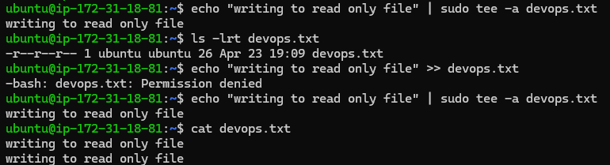

- Try executing a file without execute permission

Explanation : Executing a file without execute permission gives Permission denied. Even sudo cannot bypass this, because the shell requires the execute bit. However, you can still run the file by explicitly invoking the interpreter (e.g., bash script.sh or python3 script.py).

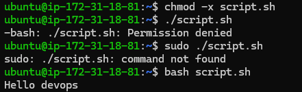

---

## Commands Used
- touch fname - Creates empty file.
- echo "Hello" > fname - Create file with content.
- vim fname - Create/open file in Vim.
- cat fname - Prints files content.
- vim -R fname - Open file in read only mode.
- cat /etc/passwd | head -5 - Prints first 5 lines of /etc/passwd.
- cat /etc/passwd | tail -5 - Prints last 5 lines of /etc/passwd.
- chmod +x fname - Adding executable permission for all(owner,group,others).
- chmod -w fname / chmod 444 fname - Removing write permission for all(owner,group,others).
- mkdir -m 755 dname - Create directory with permissions(rwx,r-x,r-x).

---

## What I Learned
- Managing files permissions effectively.
- Using sudo can override read & write restrictions.
- Sudo cannot override execute permission but calling the interpreter directly allows execution.