## Task 1: Understanding Ownership

1. Run `ls -l` in your home directory
2. Identify the **owner** and **group** columns
3. Check who owns your files

**Format:** `-rw-r--r-- 1 owner group size date filename`

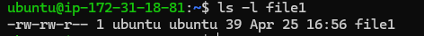

### Meaning of Each Part

| Part | Value | Meaning |
|----|----|----|
| Permissions | `-rw-rw-r--` | Who can read/write the file |
| Links | `1` | Number of hard links |
| Owner | `ubuntu` | User who owns the file |
| Group | `ubuntu` | Group that owns the file |
| Size | `39` | File size in bytes |
| Date | `Apr 25 16:56` | Last modified date & time |
| Filename | `file1` | Name of the file |

### Who Owns the File?

- **Owner:** `ubuntu`
- **Group:** `ubuntu`

### This Means:

- **ubuntu** are the **owner** of the file
- The file belongs to the **group** named **ubuntu**

### Difference Between Owner and Group

- **Owner** → The main user who created or owns the file
- **Group** → A set of users who may share access to the file

---

## Task 2: Basic chown Operations 

1. Create file `devops-file.txt`
2. Check current owner: `ls -l devops-file.txt`
3. Change owner to `tokyo` (create user if needed)
4. Change owner to `berlin`
5. Verify the changes

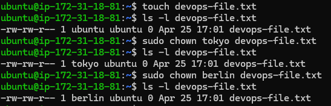

---

## Task 3: Basic chgrp Operations (15 minutes)

1. Create file `team-notes.txt`
2. Check current group: `ls -l team-notes.txt`
3. Create group: `sudo groupadd heist-team`
4. Change file group to `heist-team`
5. Verify the change

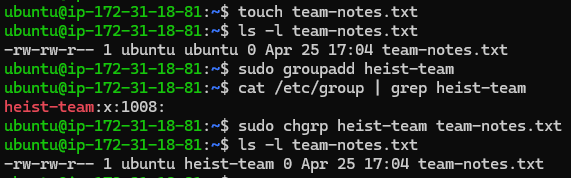

--- 

## Task 4: Combined Owner & Group Change (15 minutes)

Using `chown` you can change both owner and group together:

1. Create file `project-config.yaml`
2. Change owner to `professor` AND group to `heist-team` (one command)

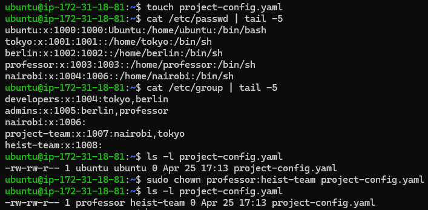

3. Create directory `app-logs/`
4. Change its owner to `berlin` and group to `heist-team`

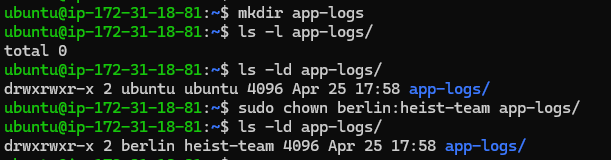

---

## Task 5: Recursive Ownership

1. Create directory structure:
   ```
   mkdir -p heist-project/vault
   mkdir -p heist-project/plans
   touch heist-project/vault/gold.txt
   touch heist-project/plans/strategy.conf
   ```

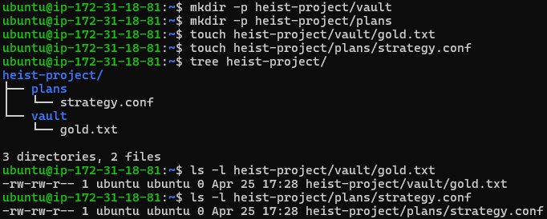

2. Create group `planners`: `sudo groupadd planners`

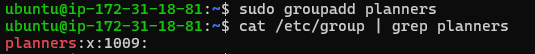

3. Change ownership of entire `heist-project/` directory:
   - Owner: `professor`
   - Group: `planners`
   - Use recursive flag (`-R`)

4. Verify all files and subdirectories changed: `ls -lR heist-project/`

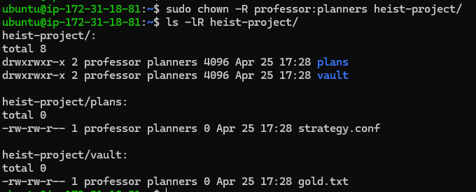

---

# Task 6: Practice Challenge (20 minutes)

1. Create users: `tokyo`, `berlin`, `nairobi` (if not already created)

2. Create groups: `vault-team`, `tech-team`

 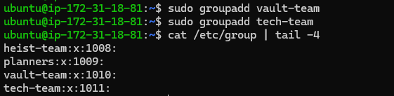

3. Create directory: `bank-heist/`
4. Create 3 files inside:
   ```
   touch bank-heist/access-codes.txt
   touch bank-heist/blueprints.pdf
   touch bank-heist/escape-plan.txt
   ```

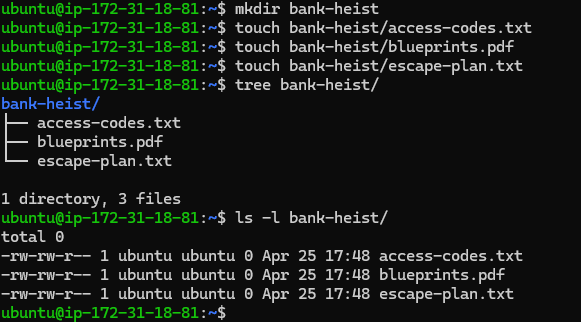

5. Set different ownership:
   - `access-codes.txt` → owner: `tokyo`, group: `vault-team`
   - `blueprints.pdf` → owner: `berlin`, group: `tech-team`
   - `escape-plan.txt` → owner: `nairobi`, group: `vault-team`

**Verify:** `ls -l bank-heist/`

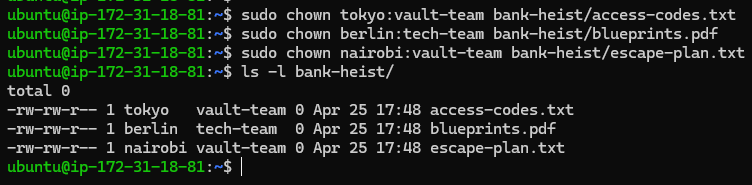

---

## Files & Directories Created
```bash
- devops-file.txt
- team-notes.txt
- project-config.yaml
- app-logs/
- heist-project/
  - vault/
    - gold.txt
  - plans/
    - strategy.conf
- bank-heist/
  - access-codes.txt
  - blueprints.pdf
  - escape-plan.txt
```

## Ownership Changes
| File/Dir                   | Before    | After                       |
| -------------------------- | --------- | --------------------------- |
| devops-file.txt            | user:user | tokyo:tokyo → berlin:berlin |
| team-notes.txt             | user:user | user:heist-team             |
| project-config.yaml        | user:user | professor:heist-team        |
| app-logs/                  | user:user | berlin:heist-team           |
| heist-project/ (all files) | user:user | professor:planners          |
| access-codes.txt           | user:user | tokyo:vault-team            |
| blueprints.pdf             | user:user | berlin:tech-team            |
| escape-plan.txt            | user:user | nairobi:vault-team          |


## Commands Used
```bash
touch devops-file.txt
ls -l
sudo useradd tokyo
sudo chown tokyo devops-file.txt
sudo useradd berlin
sudo chown berlin devops-file.txt
touch team-notes.txt
sudo groupadd heist-team
sudo chgrp heist-team team-notes.txt
touch project-config.yaml
sudo chown professor:heist-team project-config.yaml
mkdir app-logs
sudo chown berlin:heist-team app-logs
mkdir -p heist-project/vault
mkdir -p heist-project/plans
touch heist-project/vault/gold.txt
touch heist-project/plans/strategy.conf
sudo groupadd planners
sudo chown -R professor:planners heist-project/
mkdir bank-heist
touch bank-heist/access-codes.txt
touch bank-heist/blueprints.pdf
touch bank-heist/escape-plan.txt
sudo useradd nairobi
sudo groupadd vault-team
sudo groupadd tech-team
sudo chown tokyo:vault-team bank-heist/access-codes.txt
sudo chown berlin:tech-team bank-heist/blueprints.pdf
sudo chown nairobi:vault-team bank-heist/escape-plan.txt
ls -lR bank-heist/
```

## What I Learned
1.**Owner** controls the file, and has specific rights (read/write/execute).

2.**Group** allows multiple users to share permissions.

3.**chown** changes owner; **chgrp** changes group; **chown** changes both owner and group in one command.