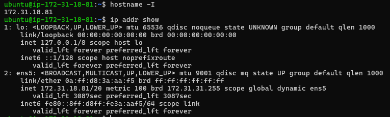
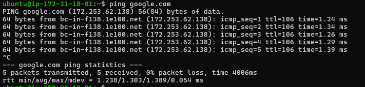
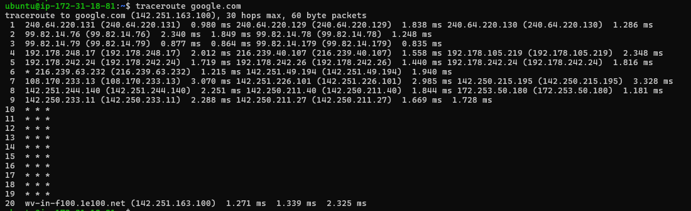
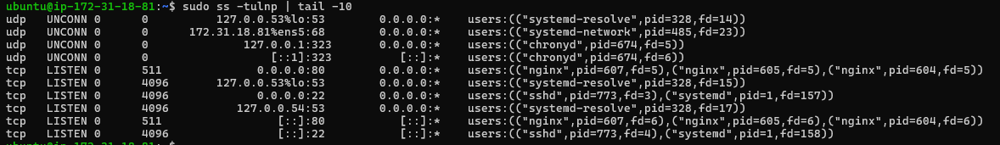
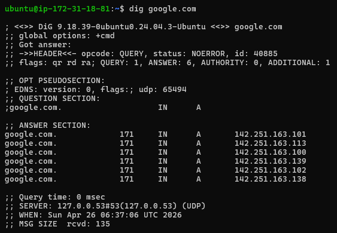
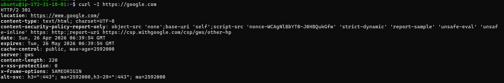
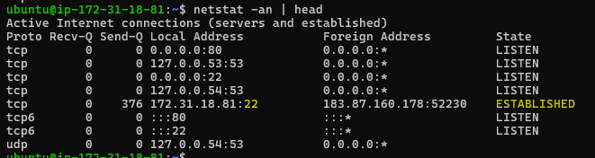
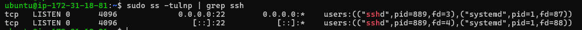
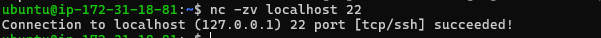

# Networking Fundamentals & Hands-on Checks

## OSI and TCP/IP Model

### OSI Model - 
OSI is a conceptual model that defines network communication. It consists of 7 layers where each layer performs a specific function.
* **Application L7** - User interaction (e.g., browser).
* **Presentation L6** - Data encryption/decryption, format conversion.
* **Session L5** - Establish/manage/terminate sessions.
* **Transport L4** - Ensures reliable data delivery using protocols like TCP/UDP.
* **Netwrok L3** - Manages logical addressing (IP) and routes data between different networks.
* **Data Link L2** - Error‑free node‑to‑node delivery.
* **Physical L1** - Transfers raw bits as electrical/optical signals through cables or wireless.

### TCP/IP Model - 
TCP/IP is practically used for providing communication between computers over the internet.

* **Application L4** - Combines OSI’s Application + Presentation + Session. 
* **Transport L3** - Ensures data delivery using TCP/UDP.
* **Internet L2** - Routes packets using IP addressing.
* **Netwrok access L1** - Handles physical connection and local data transfer(Physical + Data Link combined).

### Protocol Placement

* **HTTP, HTTPS, FTP, SMTP, DNS, DHCP, SSH** - Application layer
* **TCP, UDP** - Transport Layer
* **IP, ICMP, ARP** - Internet Layer
* **Ethernet, Wi-Fi** - Network Access layer

### One real example:
 `curl https://example.com = App layer over TCP over IP`
- Layer 7 (Application): curl creates the HTTP request (GET /index.html).
- Layer 6 (Presentation): Encrypts the data with SSL/TLS (Locked box).
- Layer 5 (Session): Adds Session ID to manage the conversation.
- Layer 4 (Transport): Wraps in TCP for reliability (Port 54321 -> 443).
- Layer 3 (Network): Adds IP addressing (Src: 192.168.1.100 -> Dst: 93.184.216.43).
- Layer 2 (Data Link): Adds MAC addresses for the local router.
- Layer 1 (Physical): Converts data to electrical signals/radio waves to travel the wire.

---

## Hands-on Checklist
- Identity: hostname -I (or ip addr show)
Observation : hostname - EC2 instance private IP is 172.31.18.81 (internal AWS VPC network).
hostname -it shows localhost address i.e 127.0.0.1/8
Ethernet ip i.e 172.31.18.81/20

- Reachability: ping google.com
Observation : 0% packet loss with 4006ms average latency confirms good network connectivity.

- Path: traceroute gogle.com
Obervation: Successfully reached the destination at hop 20, despite timeouts (* * *) at intermediate hops (11–19) caused by network security filtering.

- Ports: ss -tulpn (or netstat -tulpn) 
Obesevation: ngnix.service listening on port 80 & SSH service is listening on port 22.

- Name resolution: dig google.com
Observation: The DNS query returned status: NOERROR and successfully resolved google.com to 6 IP addresses:  142.251.163.101,142.251.163.113,142.251.163.100,142.251.163.139,142.251.163.102 and 142.251.163.138.

- HTTP check: curl -I https://www.google.com
Observation: Received HTTP status 301 (Moved Permanently), indicating the server is redirecting the request to https://www.google.com/

- Connections snapshot: netstat -an | head — count ESTABLISHED vs LISTEN (rough).
Observation: Captured 1 ESTABLISHED connection on port 22 (the active SSH session) and multiple ports in LISTEN state.

---
## Mini Task: Port Probe & Interpret

1. Identify one listening port from ss -tulpn (e.g., SSH on 22 or a local web app).
    `sudo ss -tulpn |grep ssh`

2. From the same machine, test it: nc -zv localhost <port> (or curl -I http://localhost:<port>).
    `nc -zv localhost`

3. Write one line: is it reachable? If not, what’s the next check? (e.g., service status, firewall).

- If not reachable :
Check service status - systemctl status ssh
Check logs - journlctl -u ssh
Check firewall - sudo ufw status