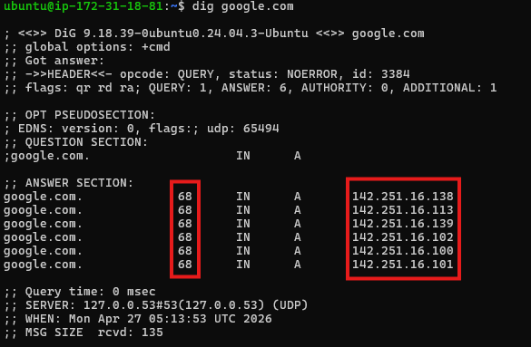
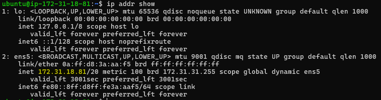
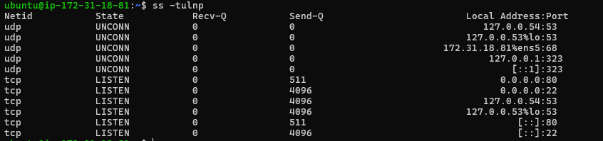

# Networking Concepts: DNS, IP, Subnets & Ports

## Task 1: DNS – How Names Become IPs

**1. What happens when you type `google.com` in a browser?**

    - First the browser checks in local cache for the corresponding IP address.
    If not present browser will send request to DNS(Domain Name Service) requesting IP address.
    
    - Computer sets up a secure connection (HTTPS) with Google’s servers using TCP/IP.
    
    - The request is routed through Google’s load balancers to the right web server.
    
    - The web server processes the request, may talk to application servers and databases, 
    and then sends back the webpage you see.

    
**2. What are these record types? Write one line each:**
   
| Record Type | Purpose | Example |
| ----------- | ------- | ------- |
| A           | Maps a domain to an IPv4 address | `google.com → 142.250.190.14` |
| AAAA        | Maps a domain to an IPv6 address | `google.com → 2001:4860:4860:0:0:0:0:8888` |
| CNAME       | Alias pointing one domain to another | `www.example.com → example.com` |
| MX          | Specifies mail servers for the domain | `example.com → mail.example.com` |
| NS          | Lists authoritative DNS servers for the domain | `example.com → ns1.example.com, ns2.example.com` |

   

**3. Run: `dig google.com` — identify the A record and TTL**
 - Observation : 
       - Domain Name - google.com
       - TTL - Second column shows TTL (Time to Live, in seconds). 68 → cache IP for 68 seconds.
       - IN - Internet 
       - A - Last column shows the actual IPv4 addresses (A Records).

---

### Task 2: IP Addressing

**1. What is an IPv4 address? How is it structured? (e.g., 192.168.1.10)**

- An IP Address is a unique numerical label assigned to each device connected to a computer network that uses the Internet Protocol for communication.

    - IPV4 is an address which is used to uniquely indentifies each device
    - It has an 4 numbers seperated by `.`(dot) & each number ranges from 0 to 255
    - First number responsible for main network i.e address class
    - Second number responsible for sub-network inside main network
    - Third number responsible LAN or VLAN
    - Fourth number indentifies each device individually

**2. Difference between public and private IPs — give one example of each**

    - Public IP: Accessible over the internet (e.g., 8.8.8.8)
    - Private IP: Used inside local networks (e.g., 192.168.1.5)

**3. What are the private IP ranges?**

    - 10.0.0.0 – 10.255.255.255 (Large enterprise networks)
    - 172.16.0.0 – 172.31.255.255 (Medium-sized organizations)
    - 192.168.0.0 – 192.168.255.255 (Home & small office networks)

**4. Run: ip addr show — identify which of your IPs are private**
    - 127.0.0.1/8 - Reserved for local host communication.
    - 172.31.18.81 - This is private ip address.

---

### Task 3: CIDR & Subnetting

**1. What does /24 mean in 192.168.1.0/24?**

Answer - /24 is CIDR notation. It tells us how many bits of the IP address are used for network portion. Here first 24 bits (out of 32) are reserved for network. That leaves 8 bits for the host address. IP range : (192.168.1.0 - 192.168.1.255) Total :256 IP's

**2. How many usable hosts in a `/24`? A /`16`? A /`28`?**
Formula: Usable Hosts = 2^(32 - CIDR) - 2

    - /24
        Usable IP = 256 -2 i.e (brodcast & CIDR base ip ) = 254
    - /16
        Usable IP = 65536 -2 i.e (brodcast & CIDR base ip ) = 65534
    - /28
        Usable IP = 16 -2 i.e (brodcast & CIDR base ip ) = 14

**3. Explain in your own words: why do we subnet?**
    * Subnet divides one large network into small, manageable and efficient sub-networks.

**4. Quick exercise — fill in:**

| CIDR | Subnet Mask     | Total IPs | Usable Hosts |
|------|-----------------|-----------|--------------|
| /24  | 255.255.255.0   | 256       | 254          |
| /16  | 255.255.0.0     | 65,536    | 65,534       |
| /28  | 255.255.255.240 | 16        | 14           | 

---

### Task 4: Ports – The Doors to Services

**1. What is a port? Why do we need them?**
    - Virtual endpoint to direct data to the correct application.
    - Multiple services can run on a single device; ports help route data correctly.

**2. Common Ports :**

| Port  | Service |
| ----- | ------- |
| 22    | SSH     |
| 80    | HTTP    |
| 443   | HTTPS   |
| 53    | DNS     |
| 3306  | MySQL   |
| 6379  | Redis   |
| 27017 | MongoDB |

**3. Run ss -tulpn — match at least 2 listening ports to their services**
  * Command: ss -tulpn
  * Example: 22 → SSH, 80 → HTTP

---

### Task 5: Putting It Together

**1. curl http://myapp.com:8080 – networking concepts involved**

       - DNS: Resolve myapp.com → IP
       - TCP: Reliable transport layer
       - HTTP: Application protocol
       - Port 8080: Directs request to specific service

**2. Database connectivity issue**

 - If app can't reach 10.0.1.50:3306:

    * ss -tulpn | grep 3306 - Check if port is open and service is listening.
    * systemctl status mysql - Check service status
    * nc -zv 10.0.1.50 3306 - Check connectivity
    * journalctl -u mysql - Check Logs

---

### What I learned
1. DNS Resolution is the Backbone of the Internet – Domain names like google.com are translated into IP addresses through a hierarchy of caches, root/TLD, and authoritative servers, enabling browsers to connect to the right server.

2. IP Addressing & Subnetting Organize Networks – Understanding public vs private IPs, CIDR notation, and subnet masks helps manage networks efficiently and calculate usable hosts.

3. Ports Direct Traffic to the Right Service – Ports act as “doors” for applications; combined with IPs and protocols like TCP/HTTP, they ensure data reaches the correct service (e.g., web, database, email).

